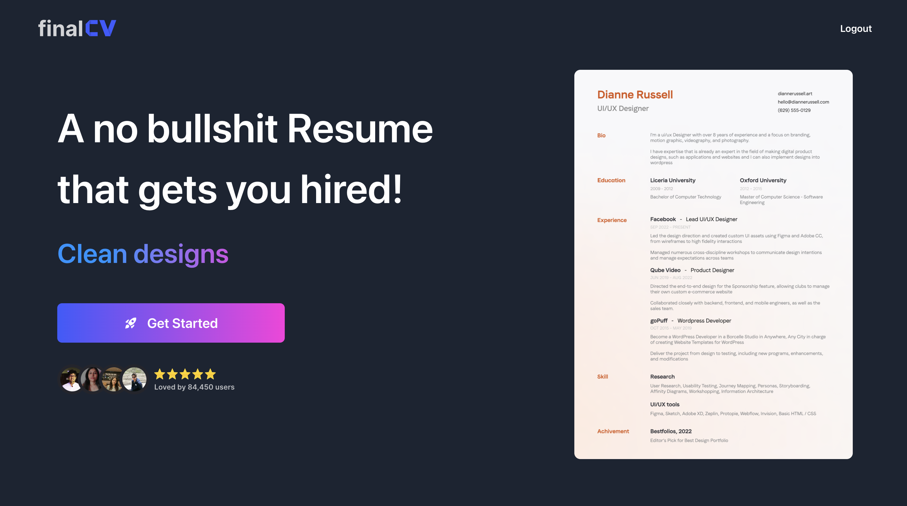

# Resume Builder

A powerful and intuitive resume builder application to help you create professional resumes with ease.

## 🚀 Demo

Check out our live demo: [Resume Builder Demo](https://drive.google.com/file/d/1MqCEOPTspBn82Pjt6y4_HIeglq1VWKye/view?usp=sharing)



## 🛠️ Installation

Get up and running with these simple steps:

1. **Clone the repository**
   ```bash
   git clone <repository-url>
   cd find-it-here
   ```

2. **Install pnpm globally**
   ```bash
   npm install -g pnpm
   ```

3. **Install dependencies**
   ```bash
   pnpm install
   ```

4. **Set up environment variables**
   ```bash
   cp apps/docs/.env.example apps/docs/.env
   cp packages/db/.env.example packages/db/.env
   ```

5. **Start PostgreSQL with Docker**
   Ensure Docker is installed, then run:
   ```bash
   docker run -d \
   -e POSTGRES_USER=postgres \
   -e POSTGRES_PASSWORD=mysecretpassword \
   -e POSTGRES_DB=find-it-here \
   -p 5432:5432 \
   --name find-it-here-db \
   postgres
   ```

6. **Generate Prisma Client and run migrations**
   ```bash
   cd packages/db
   pnpm prisma generate
   pnpm prisma migrate dev
   ```

7. **Start the development server**
   ```bash
   cd ../..
   pnpm dev
   ```

## 🌟 Features

- Intuitive user interface
- Multiple resume templates
- Real-time preview
- Export to PDF
- ATS-friendly designs

## 🤝 Contributing

Contributions, issues, and feature requests are welcome! Feel free to check [issues page](https://github.com/yashs33244/final-cv/issues).

## 👥 Contact

Your Name - [@yashs3324](https://twitter.com/yashs33244) - yashs33244@gmail.com

Project Link: [https://github.com/yashs33244/final-cv](https://github.com/yashs33244/final-cv)